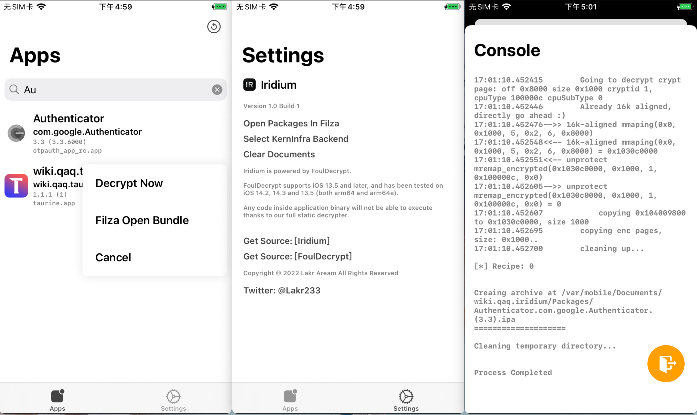

# Iridium

An iOS app decrypter, full static using fouldecrypt. Supporting iOS 13+

## Note

- We have built everything into the package, you can install and fly.
- App Iridium is running under mobile (501:501).
- Auxiliary Agent will check the app and perform any root operations.
- fouldecrypt is compiled using different KernInfra on different platforms.

## License

Iridium is licensed under MIT License, other frameworks have their own license inside the package folder.

## Thanks

- https://github.com/paradiseduo/appdecrypt
- https://github.com/Lessica/fouldecrypt
- https://github.com/NyaMisty/fouldecrypt
- https://github.com/NyaMisty/KernInfra

---

2022.1.7

Copyright © 2022 Lakr Aream. All rights reserved.